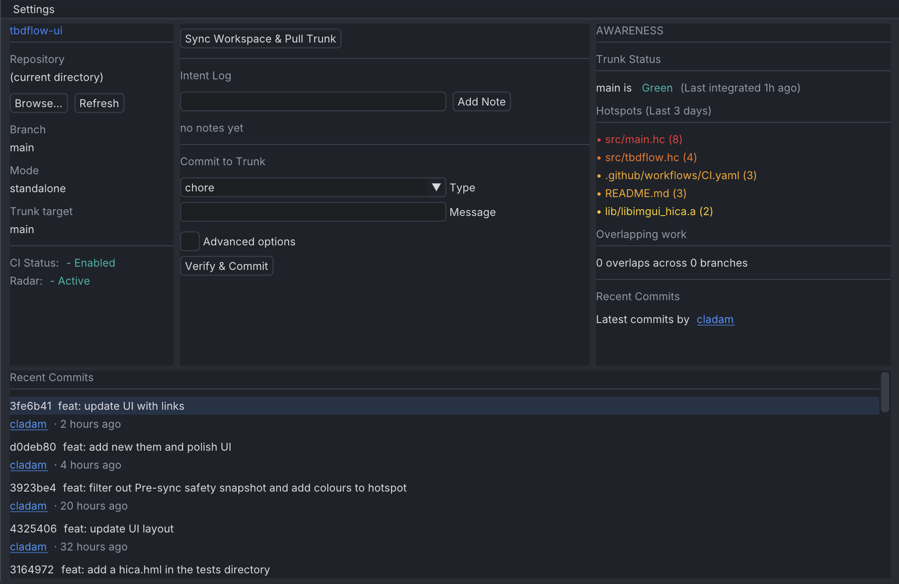

<div align="center">
  <p align="center">
    
  </p>

  <p align="center">
    <i><b>Keep your code flowing</b></i><br/>
  </p>

[](https://crates.io/crates/tbdflow)
[](https://crates.io/crates/tbdflow)
[](https://github.com/cladam/tbdflow-ui/releases/latest)

</div>

# tbdflow-ui

A desktop dashboard for [tbdflow](https://github.com/cladam/tbdflow) – the Trunk-Based Development CLI.  
Built with [hica](https://www.hica.dev) and [Dear ImGui](https://github.com/ocornut/imgui).

<div align="center">
  
</div>

## The problem

`tbdflow` is a great CLI. But switching between your editor, a terminal, and `tbdflow` commands introduces friction. You end up context-switching just to check whether the trunk is green, or to jot a quick intent note before you forget it.

`tbdflow-ui` keeps your trunk workflow visible and accessible without breaking your flow.

## What it does

A persistent three-panel window that sits alongside your editor and surfaces the `tbdflow` workflow at a glance.

| Panel | Contents |
|-------|----------|
| **Left** | Active repository, branch, mode, trunk target, CI status, Radar status |
| **Center** | Sync, Intent Log, Commit form, Recent Commits |
| **Right** | Radar – overlap scan, hotspots, ahead/behind |

### Key behaviours

- **Multi-repo** – click Browse to pick any local repository; all panels reload automatically on selection.
- **Intent Log** – type a note and press Add Note; runs `tbdflow note "<text>"` and immediately refreshes the log. Keeps your breadcrumbs visible while you work.
- **Commit form** – type dropdown is populated from the repo's live `tbdflow --json info` config. Supports scope, body, tag, issue, breaking-change, and skip-DoD flags via the Advanced options toggle.
- **Recent Commits** – last commits (configurable); click a hash to open the commit on GitHub.
- **Radar panel** – surfaces file overlap warnings, trunk CI status, and churn hotspots without leaving the window.
- **Refresh** – forces a full data reload without changing the active repository path.

All data is read via `tbdflow`'s `--json` output mode. No direct Git access, `tbdflow-ui` delegates everything to the CLI.

## Install

```sh
curl -fsSL https://github.com/cladam/tbdflow-ui/releases/latest/download/install.sh | sh
```

This downloads the pre-built binary for your platform (`macos-arm64` or `linux-x86_64`) and installs it to `~/.local/bin`. Override the install directory with `TBDFLOW_INSTALL_DIR`:

```sh
TBDFLOW_INSTALL_DIR=/usr/local/bin curl -fsSL https://github.com/cladam/tbdflow-ui/releases/latest/download/install.sh | sh
```

## Prerequisites

- [tbdflow](https://github.com/cladam/tbdflow) v0.33.0 or later on `PATH`
- SDL2: `brew install sdl2` (macOS) or `sudo apt-get install libsdl2-dev` (Linux)

## Build from source

```sh
hica run     # compile and launch
hica build   # compile to binary only
hica check   # type-check without emitting
hica clean   # remove generated files
```

Requires [hica](https://www.hica.dev) on `PATH`.

## Philosophy

`tbdflow-ui` follows the same philosophy as `tbdflow` itself:

- **The CLI is the source of truth.** The UI calls `tbdflow --json` commands; it never reimplements Git logic.
- **Low noise.** The window surfaces only what matters for the current task — trunk health, pending notes, and the commit form.
- **Stay in the flow.** The UI is a companion, not a replacement. Reach for raw `tbdflow` or `git` whenever the CLI is faster.

## Related

- [tbdflow](https://github.com/cladam/tbdflow) — the CLI this UI wraps
- [hica](https://www.hica.dev) — the language `tbdflow-ui` is written in

## Contributing

Please feel free to open an issue or submit a pull request.
